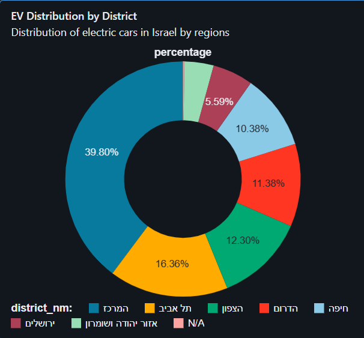
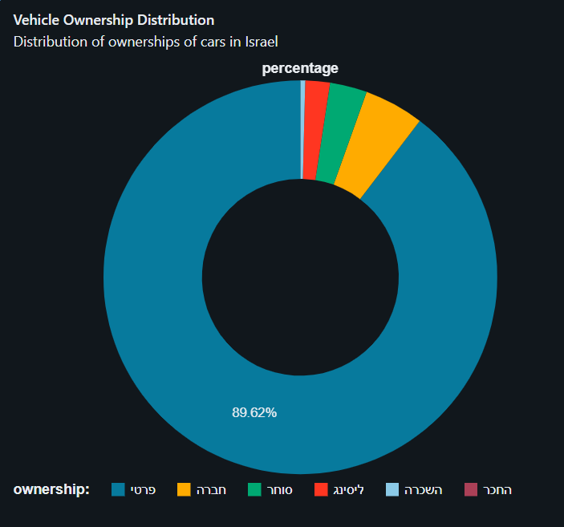
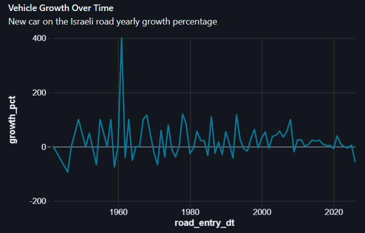
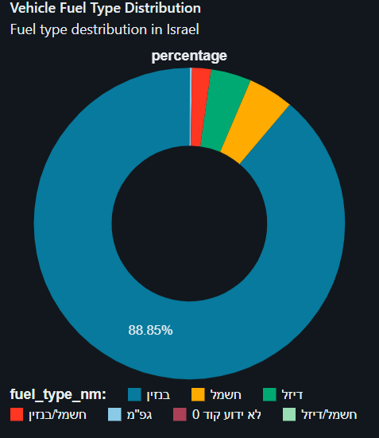
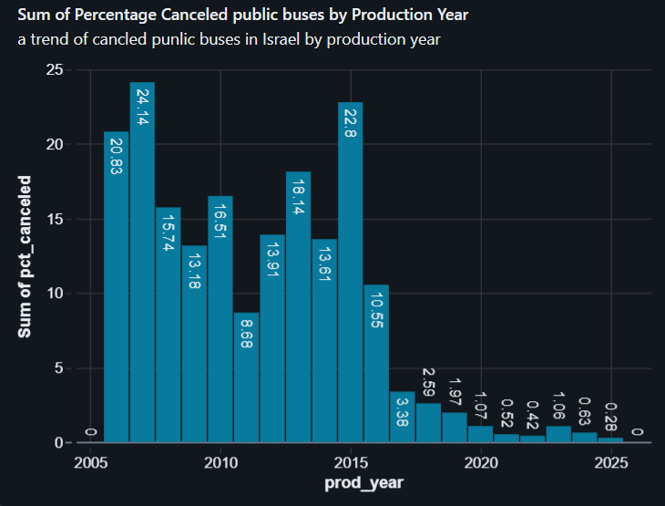

# Israeli Transportation Data Lakehouse

## Project Overview

This project covers the full analytics lifecycle: raw data ingestion, transformation, dimensional modeling, data quality validation, orchestration, and 

dashboarding in Databricks using public transportation datasets from data.gov.il.

The system follows a Medallion Architecture (Bronze → Silver → Gold) to ingest, clean, and model the data into analytics-ready tables.

---

## Architecture

### Data Flow

The pipeline is structured into three layers:

### Bronze
- Raw ingestion from Ministry of Transport APIs (REST / CSV format)
- Data stored as-is in Delta tables

### Silver
- Data cleaning and normalization
- Type casting and schema standardization
- Deduplication and validation
- Business key consistency checks

### Gold
- Dimensional modeling using Star Schema
- Fact and Dimension tables
- Referential integrity validation
- Foreign key match rate validation (100%)

---

## Data Modeling

### Star Schema Overview

### Private Vehicles

### Public Vehicles

### Motorcycles

### EV Aggregation

### Fact Tables
- `fact_private_vehicles`
- `fact_public_vehicles`
- `fact_motorcycles`
- `fact_ev_counts_by_area`

### Dimension Tables
- `dim_manufacturer`
- `dim_vehicle_type`
- `dim_fuel_type`
- `dim_color`
- `dim_ownership`

Each fact table enforces a defined grain and was validated using:
- Row count vs distinct business key checks
- Foreign key match rate validation
- Duplicate detection and fan-out join resolution

---

## Data Quality & Validation

- Grain validation (COUNT vs DISTINCT checks)
- Fan-out join detection and resolution
- Natural key uniqueness enforcement
- Foreign key match rate validation

---

## Data Volume Considerations

To accommodate the limitations of the Databricks Community Edition, ingestion was capped at ~75K records per dataset.

This approach allowed for reliable pipeline execution while preserving data diversity for analytical use cases.

In a production-grade environment, the pipeline can be scaled to process full datasets using distributed compute and optimized ingestion strategies (e.g., streaming or batch partitioning).

---

## Technologies Used

- Databricks
- PySpark
- SQL
- Delta Lake
- REST API

## Orchestration

The pipeline is orchestrated using Databricks Jobs with task dependencies between Bronze, Silver, and Gold layers.

---

---

## Dashboards

>  Dashboards built on Databricks SQL using the Gold Layer

The following dashboards demonstrate how the curated data model is leveraged to generate actionable insights from raw transportation data.

---

### Electric Vehicles Distribution by District

**Description:**  
Shows the distribution of electric vehicles across districts in Israel.

**Key Insights:**
- Identifies regions with higher EV adoption
- Highlights geographic gaps in EV penetration
- Supports infrastructure planning (e.g., charging stations)

---

### Ownership Type Distribution

**Description:**  
Breakdown of vehicles by ownership type in Israel.

**Key Insights:**
- Compares private vs leasing ownership
- Reveals dominant ownership patterns
- Useful for market and policy analysis

---

### Yearly Growth of New Vehicles

**Description:**  
Tracks the number of new vehicles entering the road in Israel each year.

**Key Insights:**
- Identifies growth trends over time
- Detects peak registration periods
- Indicates overall market expansion

---

### Fuel Type Distribution

**Description:**  
Distribution of vehicles by fuel type in Israel.

**Key Insights:**
- Shows dominance of fuel types (gasoline, electric, hybrid)
- Highlights transition toward cleaner energy
- Supports environmental analysis

---

### Public Transport Cancellation Rate

**Description:**  
Displays yearly cancellation rates of public transport in Israel.

**Key Insights:**
- Measures service reliability over time
- Identifies years with higher cancellation rates
- Useful for performance monitoring

---

## Future Improvements

- Implement Slowly Changing Dimensions (SCD)
- Add automated data quality monitoring
- Enhance dashboards with Power BI / Tableau integration
