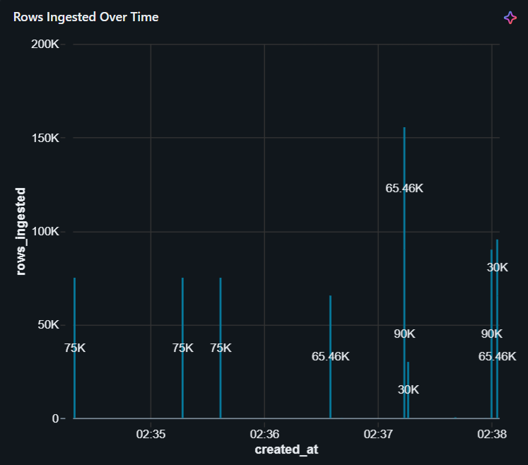
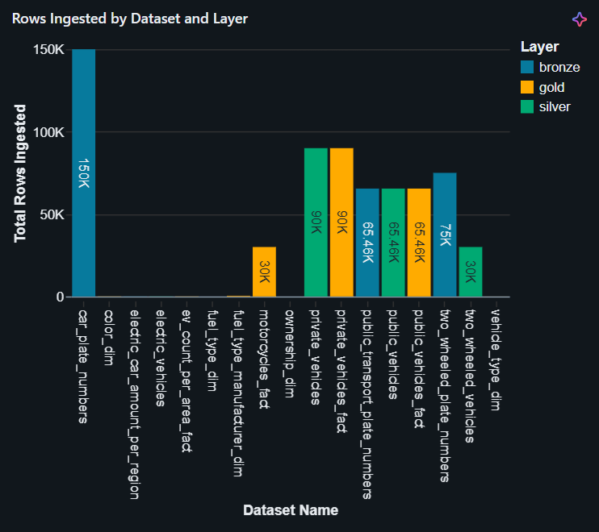
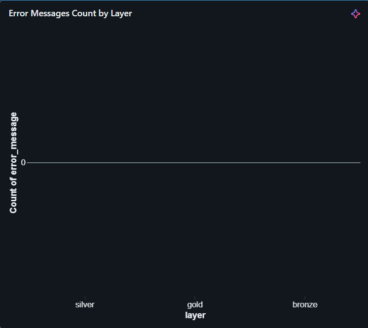
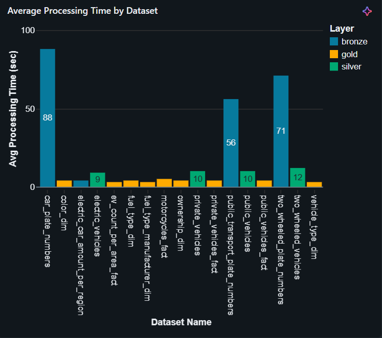

# Israeli Transportation Data Pipeline

This project implements an end-to-end Data Engineering pipeline using the Medallion Architecture (Bronze → Silver → Gold) on Databricks.

The pipeline ingests transportation data from public APIs, processes it using PySpark, models it into a Star Schema, and provides analytical dashboards and monitoring.

---

## Project Goal

This project demonstrates a full Data Engineering workflow:

- API data ingestion
- PySpark transformations
- Delta Lake storage
- Star Schema modeling
- Pipeline monitoring
- Analytical dashboards

Built as a portfolio project for Data Engineering roles.

---

## Prerequisites

Before running the project, make sure you have:

- Databricks account (Free tier is sufficient)
- Basic knowledge of Python, SQL, and Spark
- Git installed
- Internet connection (for API ingestion)

---

## Setup

1. Clone the repository:

```bash
git clone https://github.com/michaelS1305/transport_il_pipeline.git
```

2. Upload to Databricks
   
3. Go to Workspace

4. Import the project notebooks/files

5. Create a Cluster

Recommended configuration:

Runtime: Latest available

Node type: Small (Free tier)

6. Attach Notebooks

Attach all notebooks to the cluster before running

---
### Data Source

Data is fetched from the Israeli Government Open Data platform:

https://data.gov.il

The pipeline pulls multiple transportation datasets using REST APIs.

---
## Data Volume Considerations

To accommodate the limitations of the Databricks Community Edition, ingestion was capped at ~75K records per dataset.

This approach allowed for reliable pipeline execution while preserving data diversity for analytical use cases.

In a production-grade environment, the pipeline can be scaled to process full datasets using distributed compute and optimized ingestion strategies (e.g., streaming or batch partitioning).

---

## Architecture

### Data Flow

The pipeline is structured into three layers:

### Bronze
- Raw ingestion from Ministry of Transport APIs (REST / CSV format)
- Data stored as-is in Delta tables

### Silver
- Data cleaning and normalization
- Type casting and schema standardization
- Deduplication and validation
- Business key consistency checks

### Gold
- Dimensional modeling using Star Schema
- Fact and Dimension tables
- Referential integrity validation
- Foreign key match rate validation (100%)


---

## Data Modeling

### Star Schema Overview


### Private Vehicles


### Public Vehicles


### Motorcycles


### EV Aggregation


### Fact Tables
- `fact_private_vehicles`
- `fact_public_vehicles`
- `fact_motorcycles`
- `fact_ev_counts_by_area`

### Dimension Tables
- `dim_manufacturer`
- `dim_vehicle_type`
- `dim_fuel_type`
- `dim_color`
- `dim_ownership`

Each fact table enforces a defined grain and was validated using:
- Row count vs distinct business key checks
- Foreign key match rate validation
- Duplicate detection and fan-out join resolution
---

## Orchestration

The pipeline is orchestrated using Databricks Jobs with task dependencies between Bronze, Silver, and Gold layers.

---

## Dashboards

>  Dashboards built on Databricks SQL using the Gold Layer

The following dashboards demonstrate how the curated data model is leveraged to generate actionable insights from raw transportation data.

---

### Electric Vehicles Distribution by District


**Description:**  
Shows the distribution of electric vehicles across districts in Israel.

**Key Insights:**
- Identifies regions with higher EV adoption
- Highlights geographic gaps in EV penetration
- Supports infrastructure planning (e.g., charging stations)

---

### Ownership Type Distribution


**Description:**  
Breakdown of vehicles by ownership type in Israel.

**Key Insights:**
- Compares private vs leasing ownership
- Reveals dominant ownership patterns
- Useful for market and policy analysis

---

### Yearly Growth of New Vehicles


**Description:**  
Tracks the number of new vehicles entering the road in Israel each year.

**Key Insights:**
- Identifies growth trends over time
- Detects peak registration periods
- Indicates overall market expansion

---

### Fuel Type Distribution


**Description:**  
Distribution of vehicles by fuel type in Israel.

**Key Insights:**
- Shows dominance of fuel types (gasoline, electric, hybrid)
- Highlights transition toward cleaner energy
- Supports environmental analysis

---

### Public Transport Cancellation Rate


**Description:**  
Displays yearly cancellation rates of public transport in Israel.

**Key Insights:**
- Measures service reliability over time
- Identifies years with higher cancellation rates
- Useful for performance monitoring
---

## Monitoring & Observability

As part of the project, I implemented a monitoring and observability layer to improve the pipeline’s reliability, visibility, and overall production-readiness.

The monitoring system tracks execution across the **Bronze**, **Silver**, and **Gold** layers, and provides insights into both pipeline performance and data quality.

---

### What was added

- Centralized pipeline monitoring table for all layers  
- Dedicated fact quality monitoring table for Gold views  
- Integrated logging across all pipeline notebooks  
- Data quality checks for fact tables  

---

### Pipeline Monitoring

A centralized monitoring table was created to track pipeline activity across all layers.

Each pipeline run logs:

- `dataset_name` – the dataset being processed  
- `layer` – Bronze / Silver / Gold  
- `run_start_time` and `run_end_time`  
- `status` – SUCCESS / FAILED  
- `rows_ingested`  
- `error_message` (when relevant)  

This enables:

- Tracking failed runs  
- Monitoring execution trends over time  
- Comparing performance between datasets  
- Understanding pipeline behavior across layers  

---

### Fact Quality Monitoring

In addition to operational monitoring, I implemented a dedicated data quality monitoring layer for Gold fact views.

Each fact run is evaluated using the following checks:

- **Missing keys** – number of rows with NULL foreign keys  
- **Duplication check** – detection of duplicate records  
- **Key null ratio (fill rate)** – percentage of valid keys  

These metrics are stored in a separate monitoring table and provide visibility into the integrity of the dimensional model.

---

### Monitoring Architecture

The monitoring layer is based on two main components:

1. **Pipeline Monitoring Table**  
   Tracks execution across Bronze, Silver, and Gold layers  

2. **Fact Quality Monitoring Table**  
   Tracks data quality metrics for Gold fact views  

Both components are integrated into the pipeline notebooks and updated at the end of each run.

---
## Pipeline Monitoring Dashboard

### Rows Ingested Over Time



This time-series visualization tracks how many rows were ingested during each pipeline run.

It helps identify:

- Trends in data ingestion volume  
- Unexpected spikes or drops  
- Pipeline stability over time  

This is particularly useful for monitoring changes in source data or ingestion behavior.

---

### Rows Ingested by Dataset and Layer



This chart displays the volume of data processed per dataset across different pipeline layers.

It allows comparison between:

- Data volume across datasets  
- Differences between Bronze, Silver, and Gold layers  
- Potential data drops or inconsistencies between layers  

This is useful for validating pipeline completeness and ensuring data flows correctly between stages.

---

### Error Messages Count by Layer



This visualization shows the number of error messages across each pipeline layer (Bronze, Silver, Gold).

It helps identify where failures are occurring in the pipeline and whether issues are concentrated in a specific layer.

A zero value across all layers indicates stable pipeline execution without failures.

---

### Average Processing Time by Dataset



This chart shows the average processing time (in seconds) for each dataset across pipeline layers.

It helps identify:

- Performance bottlenecks  
- Heavy datasets that require optimization  
- Differences in processing time between layers  

This visualization is useful for performance tuning and understanding pipeline efficiency.

---

## Future Improvements

- Implement Slowly Changing Dimensions (SCD)
- Improve automated data quality monitoring
- Enhance dashboards with Power BI / Tableau integration

---

### Author

Michael Sandrovich
Aspiring Data Engineer

GitHub: https://github.com/michaelS1305
