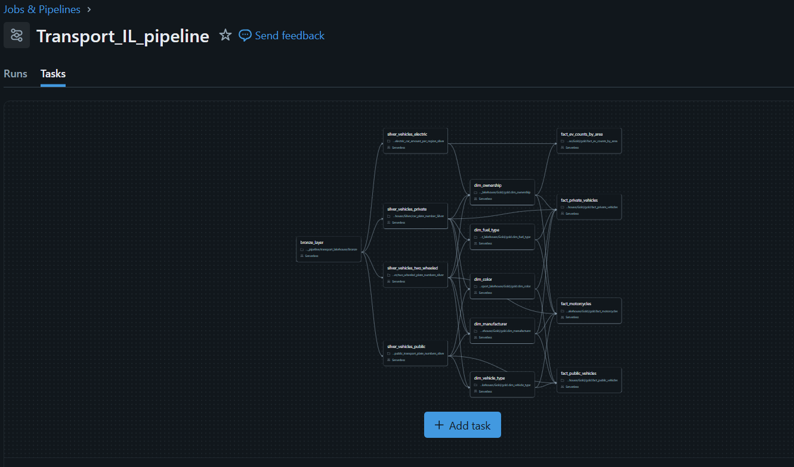

# Israeli Transportation Data Pipeline

This project implements an end-to-end Data Engineering pipeline using the Medallion Architecture (Bronze → Silver → Gold) on Databricks.

The pipeline ingests transportation data from public APIs, processes and transforms it using PySpark, models it into a Star Schema, and delivers analytical dashboards alongside pipeline monitoring.

---

## Project Goal

This project demonstrates an end-to-end Data Engineering workflow, including:

- Data ingestion from public APIs
- Medallion Architecture (Bronze → Silver → Gold)
- Data transformation with PySpark
- Delta Lake storage
- Star Schema modeling
- Pipeline monitoring and logging
- Analytical dashboards

Built as a portfolio project to demonstrate practical Data Engineering skills using Databricks and Apache Spark.

---
## Tech Stack

| Category | Technologies |
|----------|--------------|
| Programming | Python, SQL |
| Data Processing | Apache Spark (PySpark) |
| Platform | Azure Databricks |
| Data Storage | Delta Lake |
| Architecture | Medallion Architecture (Bronze → Silver → Gold), Star Schema |
| Data Source | Public REST APIs (JSON) |
| Visualization | Databricks SQL Dashboards |
| Monitoring | Pipeline Logs, Monitoring Tables |
| Version Control | Git, GitHub |

---

### Data Source

Data is fetched from the Israeli Government Open Data platform:

https://data.gov.il

The pipeline pulls multiple transportation datasets using REST APIs.

---
## Data Volume Considerations

To accommodate the limitations of the Databricks Community Edition, ingestion was capped at ~75K records per dataset.

This approach allowed for reliable pipeline execution while preserving data diversity for analytical use cases.

In a production-grade environment, the pipeline can be scaled to process full datasets using distributed compute and optimized ingestion strategies (e.g., streaming or batch partitioning).

---

## Architecture

### Data Flow

The pipeline is structured into three layers:

### Bronze
- Raw ingestion from Ministry of Transport APIs (REST)
- Data stored as-is in Delta tables

### Silver
- Data cleaning and normalization
- Type casting and schema standardization
- Deduplication and validation
- Business key consistency checks

### Gold
- Dimensional modeling using Star Schema
- Fact and Dimension tables
- Referential integrity validation
- Foreign key match rate validation (100%)

---

## Data Modeling

### Star Schema Overview

### Private Vehicles

### Public Vehicles

### Motorcycles

### EV Aggregation

### Fact Tables
- `fact_private_vehicles`
- `fact_public_vehicles`
- `fact_motorcycles`
- `fact_ev_counts_by_area`

### Dimension Tables
- `dim_manufacturer`
- `dim_vehicle_type`
- `dim_fuel_type`
- `dim_color`
- `dim_ownership`

Each fact table enforces a defined grain and was validated using:
- Row count vs distinct business key checks
- Foreign key match rate validation
- Duplicate detection and fan-out join resolution
---

## Orchestration

The pipeline is orchestrated using Databricks Jobs, coordinating the execution of multiple notebooks across the Bronze, Silver, and Gold layers. 
Task dependencies ensure each stage completes successfully before downstream transformations begin.

---

## Dashboards

>  Dashboards built on Databricks SQL using the Gold Layer

The following dashboards demonstrate how the curated data model is leveraged to generate actionable insights from raw transportation data.

---

### Electric Vehicles Distribution by District

**Description:**  
Shows the distribution of electric vehicles across districts in Israel.

**Key Insights:**
- Identifies regions with higher EV adoption
- Highlights geographic gaps in EV penetration
- Supports infrastructure planning (e.g., charging stations)

---

### Ownership Type Distribution

**Description:**  
Breakdown of vehicles by ownership type in Israel.

**Key Insights:**
- Compares private vs leasing ownership
- Reveals dominant ownership patterns
- Useful for market and policy analysis

---

### Yearly Growth of New Vehicles

**Description:**  
Tracks the number of new vehicles entering the road in Israel each year.

**Key Insights:**
- Identifies growth trends over time
- Detects peak registration periods
- Indicates overall market expansion

---

### Fuel Type Distribution

**Description:**  
Distribution of vehicles by fuel type in Israel.

**Key Insights:**
- Shows dominance of fuel types (gasoline, electric, hybrid)
- Highlights transition toward cleaner energy
- Supports environmental analysis

---

### Public Transport Cancellation Rate

**Description:**  
Displays yearly cancellation rates of public transport in Israel.

**Key Insights:**
- Measures service reliability over time
- Identifies years with higher cancellation rates
- Useful for performance monitoring
---

## Monitoring & Observability

As part of the project, I implemented a monitoring and observability layer to improve the pipeline’s reliability, visibility, and overall production-readiness.

The monitoring system tracks execution across the **Bronze**, **Silver**, and **Gold** layers, and provides insights into both pipeline performance and data quality.

---

### What was added

- Centralized pipeline monitoring table for all layers  
- Dedicated fact quality monitoring table for Gold views  
- Integrated logging across all pipeline notebooks  
- Data quality checks for fact tables  

---

### Pipeline Monitoring

A centralized monitoring table was created to track pipeline activity across all layers.

Each pipeline run logs:

- `dataset_name` – the dataset being processed  
- `layer` – Bronze / Silver / Gold  
- `run_start_time` and `run_end_time`  
- `status` – SUCCESS / FAILED  
- `rows_ingested`  
- `error_message` (when relevant)  

This enables:

- Tracking failed runs  
- Monitoring execution trends over time  
- Comparing performance between datasets  
- Understanding pipeline behavior across layers  

---

### Fact Quality Monitoring

In addition to operational monitoring, I implemented a dedicated data quality monitoring layer for Gold fact views.

Each fact run is evaluated using the following checks:

- **Missing keys** – number of rows with NULL foreign keys  
- **Duplication check** – detection of duplicate records  
- **Key null ratio (fill rate)** – percentage of valid keys  

These metrics are stored in a separate monitoring table and provide visibility into the integrity of the dimensional model.

---

### Monitoring Architecture

The monitoring layer is based on two main components:

1. **Pipeline Monitoring Table**  
   Tracks execution across Bronze, Silver, and Gold layers  

2. **Fact Quality Monitoring Table**  
   Tracks data quality metrics for Gold fact views  

Both components are integrated into the pipeline notebooks and updated at the end of each run.

---
## Pipeline Monitoring Dashboard

### Rows Ingested Over Time

This time-series visualization tracks how many rows were ingested during each pipeline run.

It helps identify:

- Trends in data ingestion volume  
- Unexpected spikes or drops  
- Pipeline stability over time  

This is particularly useful for monitoring changes in source data or ingestion behavior.

---

### Rows Ingested by Dataset and Layer

This chart displays the volume of data processed per dataset across different pipeline layers.

It allows comparison between:

- Data volume across datasets  
- Differences between Bronze, Silver, and Gold layers  
- Potential data drops or inconsistencies between layers  

This is useful for validating pipeline completeness and ensuring data flows correctly between stages.

---

### Error Messages Count by Layer

This visualization shows the number of error messages across each pipeline layer (Bronze, Silver, Gold).

It helps identify where failures are occurring in the pipeline and whether issues are concentrated in a specific layer.

A zero value across all layers indicates stable pipeline execution without failures.

---

### Average Processing Time by Dataset

This chart shows the average processing time (in seconds) for each dataset across pipeline layers.

It helps identify:

- Performance bottlenecks  
- Heavy datasets that require optimization  
- Differences in processing time between layers  

This visualization is useful for performance tuning and understanding pipeline efficiency.

---

## Performance Optimization

The pipeline was optimized by reducing unnecessary Spark actions, streamlining transformations, and materializing the Gold layer. 
These improvements reduced the total runtime from **6 minutes 8 seconds** to **3 minutes 40 seconds**, achieving approximately a **40% performance improvement**.

---

### Author

Michael Sandrovich
Data Engineer

